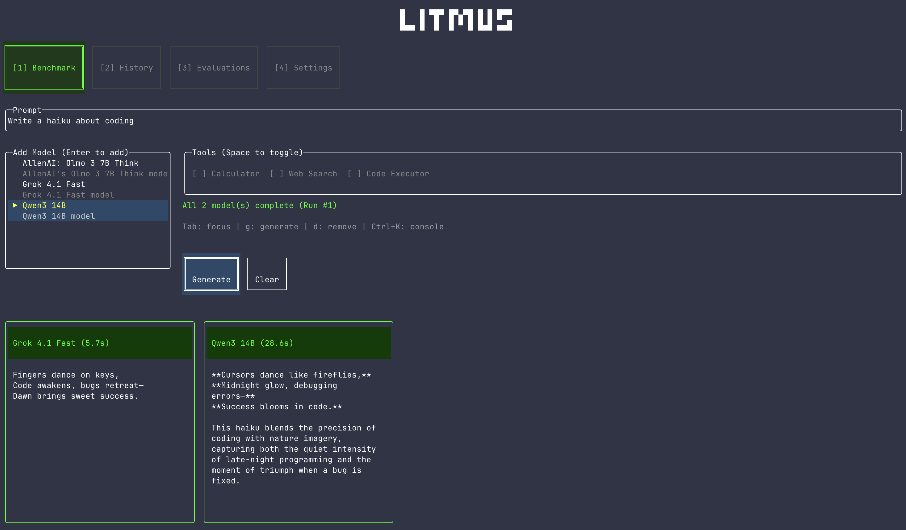
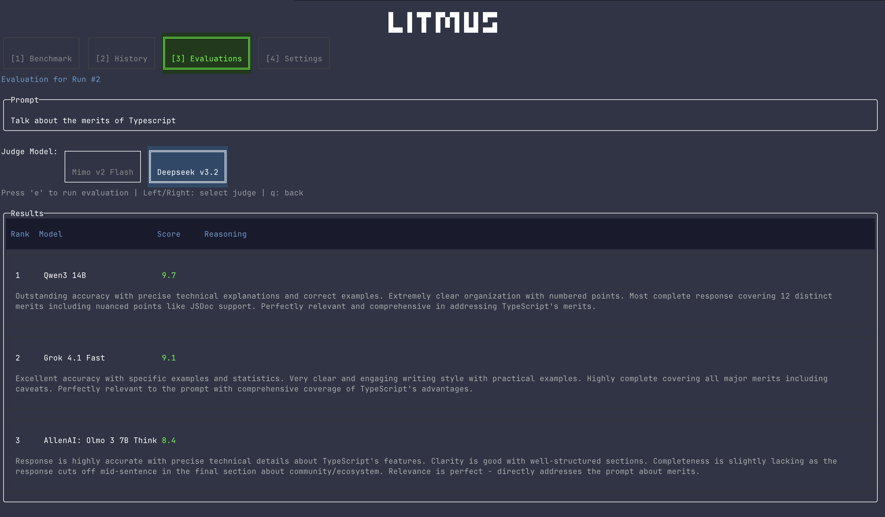
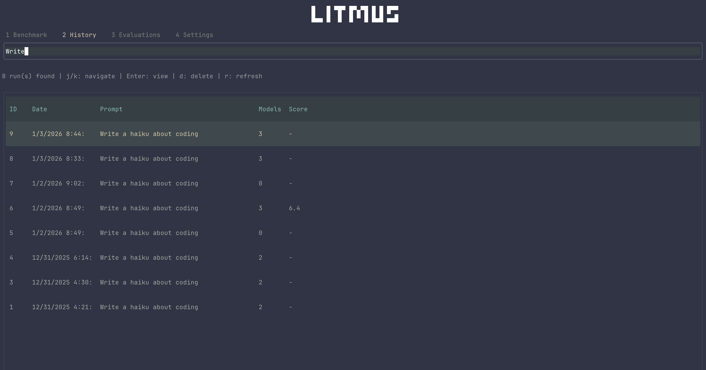

Litmus

A terminal-based LLM benchmarking and evaluation tool built with **OpenTUI**. Compare multiple language models side-by-side, evaluate their tool usage capabilities, and analyze results with evals



## Features

### Model Comparison

- Run identical prompts across multiple LLMs simultaneously
- Real-time streaming responses with progress indicators
- Supports basically any model via Openrouter - who knows what will work and what won't.
- Visual comparison grid with response timing
- **Multi-modal support** - Attach images to prompts (see Image Attachments below)

### Image Attachments

Litmus supports multi-modal prompts with image attachments. You can attach images in multiple ways:

**Clipboard Paste (Ctrl+V)**

- Copy an image to your clipboard (Cmd/Ctrl+C on any image)
- Press `Ctrl+V` in the Benchmark view to attach

**File Path**

- Type or paste a file path to an image
- Supports `~/` home directory expansion
- Example: `~/photos/screenshot.png`

**Supported Formats**: PNG, JPG, JPEG, GIF, WebP, BMP

**Image Controls**

- `x` - Remove last attached image
- `c` - Clear all attached images
- `i` - Open image input dialog (alternative method)
- Images are displayed above the prompt input when attached

### Evals using LLM-as-Judge

- Run automated evaluations using dedicated judge models
- Multi-criteria scoring (accuracy, relevance, reasoning, tool use)
- Pairwise comparisons and ranking
- Detailed reasoning and score breakdowns



### Persistent Storage

- SQLite database for all benchmark runs and results
- Searchable history of past runs
- Track performance over time



## Installation

Requires [Bun](https://bun.sh)

```bash
bun add -g litmus-ai
```

```bash
litmus
```

### Environment Setup

Create a `.env` file in your working directory or export the variables:

```bash
export OPENROUTER_API_KEY=your_key_here
```

## Quick Start

```bash
litmus
```

### Basic Workflow

1. **Select Models** - Choose from available models in the dropdown
2. **Enter Prompt** - Type your test prompt or select from templates
3. **Enable Tools** - Toggle tools to test function calling (optional)
4. **Generate** - Press `Enter` or `g` to run the benchmark
5. **Evaluate** - Press `e` in the Evaluation view to run LLM-as-judge scoring

## Configuration

### Environment Variables

```bash
OPENROUTER_API_KEY=your_key_here  # Required - get from https://openrouter.ai
EXA_API_KEY=your_key_here         # Optional - for web search tool (https://exa.ai)
```

## Evaluation Criteria

Litmus evaluates models on:

- **Accuracy** - Correctness of information
- **Completeness** - Thoroughness of response
- **Relevance** - How well it addresses the prompt
- **Clarity** - Communication quality
- **Tool Use** - Proper function calling (when applicable)
- **Overall Score** - Weighted combination

## Keyboard Shortcuts

### Global

- **Ctrl+K** - Toggle console
- **Tab** - Cycle focus
- **Escape** - Back/Focus nav

### Benchmark View

- **g** - Generate responses
- **Enter** - Add model (when focused)
- **Space** - Toggle tool
- **d** - Remove last model
- **Ctrl+V** - Paste image from clipboard
- **i** - Open image input dialog
- **x** - Remove last attached image
- **c** - Clear all attached images
- **/** - Search/add models

### Evaluation View

- **e** - Run evaluation
- **Left/Right** - Select judge model
- **q** - Back to history

### History View

- **/** - Focus search
- **Enter** - Select run
- **Delete** - Remove run

## Development

```bash
# Install dependencies
bun install

# Run development mode
bun dev

# Build for production
bun build

# Run tests
bun test
```

## License

MIT License - see LICENSE file for details.

- 🐛 [Issue Tracker](https://github.com/your-username/Litmus/issues)
